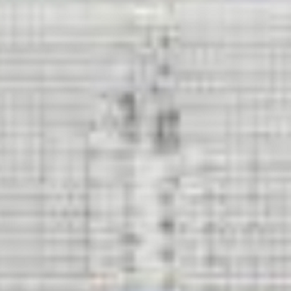
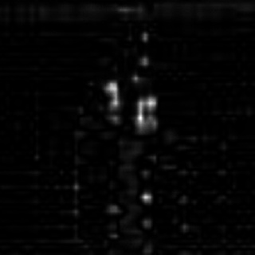
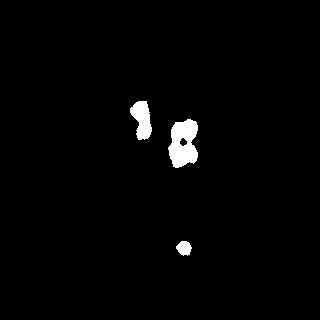

# Defect Detecting:Bodies Close But Souls Apart
---

## 1. Abstract

Defect Detecting With Cuda project is an open source software based on opencv-3.3.0 library and cuda-8.0 in nvidia, 
which focus on surface defect inspection with saliency filter. 
Open Source Computer Vision Library.[opencv https://opencv.org/](https://opencv.org/) 
Introduction about CUDA .[cuda https://en.wikipedia.org/wiki/CUDA](https://en.wikipedia.org/wiki/CUDA) 
Introduction about saliency .[saliency https://en.wikipedia.org/wiki/Salience_(neuroscience)](https://en.wikipedia.org/wiki/Salience_(neuroscience))   

## 2. Usage
### Compiled opencv-3.3.0 with cuda using CMake, CUDA8.0 in ubuntu 16.04
- download and install CUDA-8.0 from [https://developer.nvidia.com/cuda-80-download-archive](https://developer.nvidia.com/cuda-80-download-archive)  
- then just simply run the shell script ./script/prepare_install.sh for environment setting up 

### How to use this project for defect detecting

- configure autogen.sh and using the shell script to generate the Makefile

- make the Makefile

- ./fabric-detect sample.jpg

## 3. Applications

### 3.1 Fabric Defects Inspection step 1

  
  

### 3.2 Fabric Dectects Inspection step 2

  
  

## 4. Contact

|Author          | Email            | Wechat      |
| ---------------|:----------------:| -----------:|
| chenzhengqiang | 642346572@qq.com | 18819373904 |

**Notice:  Any comments and suggestions are welcomed**

## 5. License
[Apache License 2.0](./LICENSE)
